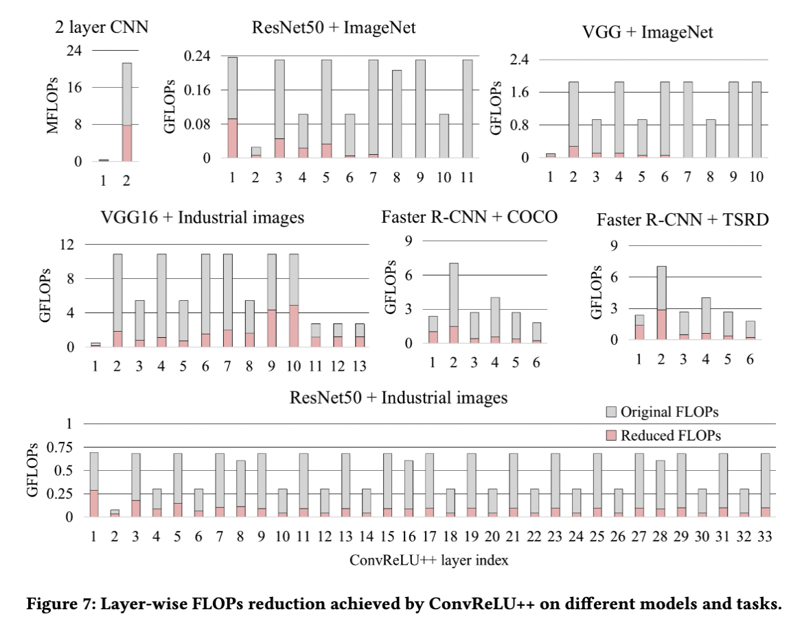

# Code for "ConvReLU++: Reference-based Lossless Acceleration of Conv-ReLU Operations for Mobile Deep Vision"


This repo contains three frameworks code, including Pytorch, TFlite-micro and NCNN. Please refer to instructions in each folder(ncnn_src/pytorch_src/tflite-micro_src)

# Directory Structure

```
.
├── LICENSE
├── README.md
├── ncnn_src    # code in NCNN
├── pytorch_src    # code in Pytorch
└── tflite-micro_src    # code in TFlite-micro
```


# Main Experiment Results
Flops reduction experiments on laptop with NCNN.
